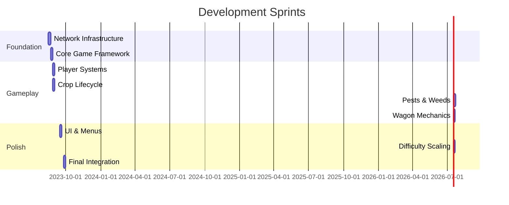

# Eat with the Same Mouth
---




# **Same Mouth - Cooperative Farming Game**  

## **Game Overview**  
- Cooperative farming game for 2+ players  
- Objective: Grow and harvest as many crops as possible before being overwhelmed by squirrels, rabbits, and weeds  
- Players must work together—benefits are shared  
- Game ends when players collectively decide to take the wagon away  


---

## Approach

 - If you need documentation, use context7, the mcp server you have access to. Never do a websearch first.
 - we are using solidjs and tauri. The boilerplate is already written.
 - If you want to test the tauri app, use `pnpm run tauri build` so that you can see if it compiles, dont try `pnpm run tauri dev` because you wont be able to turn it off and then you'll be stucksi.
- the multiplayer functionality is the most challenging so we should get this up and running before we add all of the functionality. can make a small lobby for the characters to move in and then make sure we can get several joining the hosts room before building out the game features.


## **Game Mechanics**  

### **Core Systems**  
- **Tile Map**:  
  - Size varies based on number of players  
  - We want way bigger maps than we started with, maybe like 3x the size, so 25 by 25 instead of 10 by 10.
  - Tile distribution ratios (e.g., 60% farmable, 10% obstacles, 5% role stations)  
  - Path validation: Guaranteed routes between critical stations  
  - Scaling formula: Map dimensions = base_size + (players * increment) 

- **Tile Types**:  
  - Farmable land  
  - Role-switching tiles (one per role)  
  - Wagon tiles (asset on tile, only one wagon)  
  - Impassable tiles (rocks, trees, water)  
  - Exit tiles (where wagon is pulled off)  
  - Pest drop-off tiles  
  - Wagon path tiles  

### **Roles & Actions**  
- Players can swap roles by switching tools at dedicated spots:  
  - Till the soil  
  - Plant seeds  
  - Water  
  - Weeding  
  - Capture pests  
  - Harvesting  

### Roles

  - Tiller
    - tills farmable soil to get it ready for planting
    - tilling removes weeds as well
    - a little slower than walking
    - instead of faster tilling in a single direction we could try autotill tiles when moving in the same direction (meaning you dont have to push the action button) 
    - Clears weeds (slower than weeding role)  
    - Cannot till occupied tiles
    - if tilled soil isnt planted in 2 growth periods it returns to normal
    - weeds return tilled soil to normal
  -  Planter
    - plant seeds in tilled soil
  - waterer
    - Shoots water in a triangle spout (3 tiles in facing direction)  
    - No over-watering penalty 
    - after a growth period the tile goes back to unwatered state
  - harvester
    - when crops reach mature stage and are ready to harvest harvester can tap action button on them to pick up
    - takes them to wagon and tap action button to deposit
    - can only carry one at a time
  - Weeder
    - tap action button to remove weeds on a tile
  - pest catcher
    - tap action button on pest to pick it up
    - There are a couple tiles on the edge of the map where you can drop pests for them to leave the map
    - carry the pest to the tile and tap action button to get rid of it
    - can only carry one pest at a time

- **Role Switching Rules**:  
  - No cooldown or limitations  
  - Any number of players can be in the same role  
  - Change happens instantly with visual feedback  
  - Players cannot hold multiple roles at once    


- **Encouragement Mechanic**:  
  - Action button when touching another player grants both a 10s speed boost  
  - Cooldown: 10s  

### **Crop Lifecycle**  
- Stages: seed → sprout → sprout 2 → sprout 3 -> sprout 4 → mature  
- Rules:  
  - Can only plant seeds in tilled tiles  
  - Grows twice as fast if watered at each stage  (beneficial but not required)
  - Must be watered every other stage (or growth stalls and doesnt progress to the next stage)  (at stages seed sp2 sp4)
  - movement to the next stage of growth occurs after double of a time period called growth period, if watered that stage, only a single growth period (if the growth period is 5 seconds, then 20 seconds to move to the next stage unless this stage got watered then 10 seconds, and on stages seed, sp2 and sp4 we dont move on unless watered)

### **Pests & Weeds**  
- **Weeds**:  
  - Prevent crop growth  
  - Spread to adjacent tiles  
  - If left too long, tile reverts to original state  
  - Combination spawn: Random + adjacent spread  

- **Pests (Squirrels/Rabbits)**:  
  - Steal crops from the wagon  
  - Movement: Cycle N/E/S/W preferences, flee when wagon approaches  
  - the pests should move around a bit, though slower, maybe 1/3 as often, before there is anything for them to take.
  - AI: Move toward nearest harvest-ready crop or wagon  
  - Capture: Pick up pests and drop them at designated tiles 
  - to pick up a pest stand next to it facing it and tap the action button while in the pest catching role
  - you can only carry one at a time

### **Wagon Mechanics**  
- Requires all players grab it by facing it while next to it and pressing action button (stand next to it and press action button)  
- Direction: Only toward exit path  
- if everyone is grabbing the wagon any player pushing in the direction of the wagon path will take it down the road
- Successfully pulling it off-screen ends the game  \
- Wagon follows predefined path tiles, ignores off-path inputs
- wagon is like 4 tiles large
- wagon is toward the center of the map, with a straight path in one direction toward the edge of the map

### **Difficulty & Progression**  
- **Thresholds**:  
  - Fixed crop milestones increase difficulty (faster weeds/pests)  
  - Unlock more powerful role versions at certain thresholds  
- **Scoring**: Pure crop count harvested  

### **Player Count Scaling**
- **Goal**: Maintain similar task density per player regardless of group size (2-8 players)
- **Scaling Formula**:  
  `playerMultiplier = 1 + (playerCount - 2) × scalingFactor`  
  (Base: 2 players, scalingFactor: 0.2-0.35 per config)
- **Scaled Elements**:
  - Map dimensions: `base_size + (playerCount × increment)`
  - Initial threats (weeds/pests): `base_count × playerMultiplier`
  - Threat spawn rates: `base_rate × playerMultiplier`
  - Crop thresholds: `base_threshold × playerCount`
  - Upgrade efficiency: Diminishing returns at higher player counts


---

## **Technical Implementation**  

### **Network & Multiplayer**  
- **Architecture**:  
  - the game is built with phaserjs
  - multiplayer is challenging and we should start getting that configured in an early sprint while the app is not complex yet
  - Tauri app hosts game room on local network  
  - Others join via static PWA webpage (offline-first)  
  - both tauri app and pwa webpage are the same except the tauri app can host the games, so the gameplay inteface and everything can share code
  - front end of tauri app and pwa are the same except for host specific features in the tauri app, will use the same codebase because tauri front end is web valid code
  - Handles multiple rooms on same network; option to choose which to join
  - One way to easily connect clients with the hosting tauri app is to have the system replace IP address segments (like 192.168.0.10) with short, memorable agricultural words (e.g., corn, soil, tractor) by mapping common low-numbered IPs to the simplest farming terms and reserving longer or niche words for higher, less-used addresses. It makes networks easier to identify while keeping the agricultural theme consistent across all devices. 192.168.0 can be replaced with farm and 10 with soil, so then the room is named 'farm soil' and the client can type that in to find the device (and we can use a uncommon specific obscure port so they already know which port to check/serve hardcoded on both ends).
  - host lobby and client lobby once joined displays qr code to the pwa with the ip address farm word code passed through so that another played could autojoin. For development we can have the pwa's url just be whatever the dev server for it is, but once we are ready to deploy we can put the deployed url in there.

- **Data Sync**:  
  - Players: Delta sync every tick  
  - Pests: Full state every 3 ticks  
  - Weeds: Delta sync on interaction  
  - Crops: Client-authoritative  

- **Disconnections**:  
  - Remaining players continue  
  - Disconnected player can rejoin (character freezes in meantime)  

### **UI & Views**  
- **Game Views**:  
  - Host a room (join, name entry, character selection)  
  - Game view (main play screen)  
  - Game completed (crop count summary)  
  - History/highscores (will show which players/characters and the number of crops and the length of time, and difficulty setting) 
  - Settings  
  - Instructions (accessible from pause/home)  

- **Controls**:  
  - Mobile: On-screen D-pad + action button (camera follows player)  
  - Desktop: Keyboard (supports multiple local players)  
  - default controls on desktop should be arrow keys and spacebar
  - Even though we are testing with emojis at first we need some way of knowing what direction the character is facing.  For now we can use a little arrow, in the future we will have the character asset turn once it is drawn

### **Development Process**  
- **Placeholders**: Emojis for assets, color-coded tiles  
- **Adjustable Levers**:  
  - Map size, tile distribution  
  - Plant growth speed  
  - Pest/weed spawn rates  
  - Difficulty thresholds  

- **Pause System**:  
  - One player requests pause, another confirms  

---

## **Answered Design Questions**  

1. **Wagon Movement**: Tile-based, all players must push.  
2. **Pest Behavior**: Physical removal (emoji state change).  
3. **Role Switching**: Instant, no limits beyond tile occupancy.  
4. **Crop Growth**: Water every other stage or stall.  
5. **Difficulty Scaling**: Fixed crop milestones increase pests/weeds.  
6. **Pause System**: 1 requests, any other confirms.  
7. **Camera**: Mobile follows player; desktop shows more map.  
8. **Disconnection**: Character freezes, can rejoin.  
9. **End Game**: Triggered by wagon pulled off-map.  
10. **Progression**: Teamwide unlocks + temporary role boosts.  
11. Difficulty settings: We will want at least 3 to start with

---

## **Future Considerations**  
- Expand with different crop types  
-  (selectable on host screen)  

--- 


## Comprehensive List of Adjustable Levers
Here's every configurable parameter with scaling considerations:

#### **Core Levers**
1. **Map Size**
   - `base_map_size` (e.g., 6)
   - `map_increment_per_player` (e.g., 1.5)
   - Scaling: Linear

2. **Tile Distribution** (%)
   - Farmable land
   - Obstacles
   - Role stations
   - Pest drop-off
   - Wagon paths
   - Scaling: Fixed ratios

#### **Growth & Timing**
3. `crop_growth_base_time` (sec/stage) (these are per stage)
4. `watering_speed_multiplier` (e.g., 2x)
5. `water_requirement_frequency` (every N stages)
6. `weed_spread_interval` (sec)
7. `weed_reversion_time` (sec)
8. `pest_spawn_rate` (pests/min)
   - Scaling: `base_value × playerMultiplier`

#### **Threat Management**
9. `initial_weed_count`
10. `initial_pest_count`
    - Scaling: `base_value × playerMultiplier`
11. `weed_spread_pattern` (adjacent/random)
12. `pest_movement_speed` (tiles/sec)
13. `pest_target_weights` (% crops vs wagon)

#### **Difficulty Scaling**
14. `crop_thresholds_base` (e.g., 10)
    - Scaling: `base_value × playerCount`
15. `difficulty_increase_per_threshold` (%)
16. `upgrade_thresholds_base` (e.g., 20)
    - Scaling: `base_value × playerCount`
17. `upgrade_efficiency_gain` (%)

#### **Player Mechanics**
18. `tilling_speed_straight` (multiplier)
19. `tilling_speed_turning` (multiplier)
20. `watering_pattern_size` (tiles)
21. `encouragement_boost` (% speed)
22. `encouragement_duration` (sec)
23. `encouragement_cooldown` (sec)
24. `wagon_movement_speed` (tiles/sec)

#### **Scaling Parameters**
25. `scaling_factor` (0.2-0.35)
26. `map_scaling_method` (linear/diminishing)
27. `threat_scaling_method` (linear/exponential)
28. `upgrade_efficiency_scaling` (diminishing formula)

## Three Player-Scaled Configurations


### Balanced Growth (Casual)
```javascript
{
  base_map_size: 25,  // Scaled from 6 (4.17x)
  map_increment_per_player: 6.3,  // Scaled from 1.5
  tile_distribution: { farmable:60, obstacles:10, roles:10, pest_drop:5, paths:15 },
  crop_growth_base_time: 15,
  water_requirement_frequency: 2,
  initial_weed_count: 17,  // Scaled from 4
  initial_pest_count: 13,  // Scaled from 3
  pest_spawn_rate: 1.0,
  crop_thresholds_base: 42,  // Scaled from 10
  difficulty_increase_per_threshold: 63,  // Scaled from 15
  upgrade_thresholds_base: 83,  // Scaled from 20
  upgrade_efficiency_gain: 25,
  scaling_factor: 0.25,
  scaling_methods: {
    threats: "linear",
    upgrades: "diminishing_log"
  }
}
```

### Rapid Overgrowth (Challenging)
```javascript
{
  base_map_size: 34,  // Scaled from 8 (4.25x)
  map_increment_per_player: 5.1,  // Scaled from 1.2
  tile_distribution: { farmable:50, obstacles:20, roles:15, pest_drop:5, paths:10 },
  crop_growth_base_time: 10,
  water_requirement_frequency: 1,
  initial_weed_count: 26,  // Scaled from 6
  initial_pest_count: 21,  // Scaled from 5
  pest_spawn_rate: 1.5,
  crop_thresholds_base: 34,  // Scaled from 8
  difficulty_increase_per_threshold: 106,  // Scaled from 25
  upgrade_thresholds_base: 64,  // Scaled from 15
  upgrade_efficiency_gain: 40,
  scaling_factor: 0.3,
  scaling_methods: {
    threats: "linear",
    upgrades: "diminishing_sqrt"
  }
}
```

### Precision Farming (Expert)
```javascript
{
  base_map_size: 42,  // Scaled from 10 (4.2x)
  map_increment_per_player: 3.4,  // Scaled from 0.8
  tile_distribution: { farmable:60, obstacles:15, roles:8, pest_drop:7, paths:10 },
  crop_growth_base_time: 12,
  water_requirement_frequency: 3,
  initial_weed_count: 34,  // Scaled from 8
  initial_pest_count: 25,  // Scaled from 6
  pest_spawn_rate: 1.2,
  crop_thresholds_base: 50,  // Scaled from 12
  difficulty_increase_per_threshold: 84,  // Scaled from 20
  upgrade_thresholds_base: 105,  // Scaled from 25
  upgrade_efficiency_gain: 50,
  scaling_factor: 0.25,
  scaling_methods: {
    threats: "exponential_0.7",
    upgrades: "diminishing_exp_0.7"
  }
}
```


### Implementation Notes:
1. **Scaling Functions**:
```javascript
// Linear scaling
const linear = (base, players) => 
  base * (1 + (players - 2) * scalingFactor);

// Diminishing returns (logarithmic)
const diminishingLog = (base, players) => 
  base / Math.log(players + 1);

// Exponential scaling
const exponential = (base, players, exponent) => 
  base * Math.pow(players, exponent);
```

2. **Test Matrix**:


| Player Count | Config 1 (Balanced) | Config 2 (Challenging) | Config 3 (Expert) |
|--------------|---------------------|------------------------|-------------------|
| 2 players    | 30×30               | 34×34                  | 42×42             |
| 4 players    | 42×42               | 46×46                  | 50×50             |
| 6 players    | 54×54               | 58×58                  | 58×58             |
| 8 players    | 66×66               | 70×70                  | 66×66             |


3. **Metrics to Track**:
   - Threat density (weeds+pests)/player
   - Time to first threshold
   - Upgrade utilization rate
   - Failure reason (weeds/pests/wagon)


   ----
   As we worked through a first implementation some things surfaced

   - we are building the game with phaserjs 
   - We want way bigger maps than we started with, maybe like 3x the size.
   - multiplayer is challenging and we should start getting that configured in an early sprint while the app is not complex yet
   - One way to easily connect clients with the hosting tauri app is to have the system replace IP address segments (like 192.168.0.10) with short, memorable agricultural words (e.g., corn, soil, tractor) by mapping common low-numbered IPs to the simplest farming terms and reserving longer or niche words for higher, less-used addresses. It makes networks easier to identify while keeping the agricultural theme consistent across all devices. 192.168.0 can be replaced with farm and 10 with soil, so then the room is named 'farm soil' and the client can type that in to find the device (and we can use a uncommon specific obscure port so they already know which port to check/serve hardcoded on both ends).
   - Even though we are testing with emojis at first we need some way of knowing what direction the character is facing.  For now we can use alittle arrow, in the future we will have the character asset turn once it is drawn
   - default controls on desktop should be arrow keys and spacebar
   - the pests should move around a bit, though slower, maybe 1/3 as often, before there is anything for them to take.
